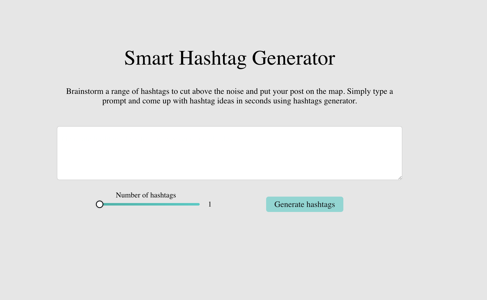
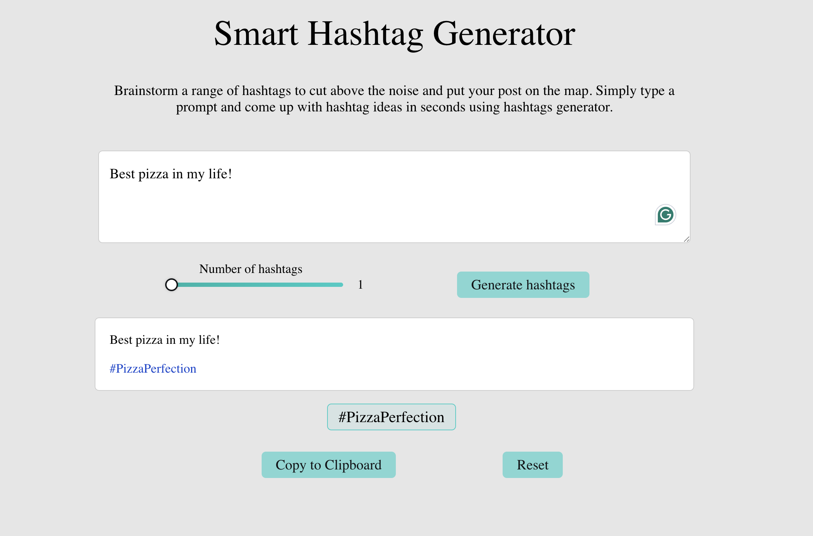

# Smart Hashtag Generator

**Smart Hashtag Generator** is a web application for quickly generating relevant hashtags for social media posts. Paste or type your post, select the number of hashtags, and click **Generate Hashtags**. The AI will generate relevant hashtags, which you can add to your original post by clicking on them. Once you've selected the desired hashtags, the final post can be copied to your clipboard and shared on your social media.

---

## Screenshots / Demo

**Main Page**  

**Hashtag Generation**  

## Technologies

- React
- Sass
- OpenAI API

---

## Installation and Running the Project

Clone the repository with `git clone https://github.com/pylypchukroman/smart_hashtag_generator.git`, navigate into it with `cd smart-hashtag-generator`, install dependencies with `npm install`, create a `.env` file in the project root containing your OpenAI API key as `REACT_APP_OPENAI_API_KEY=your_api_key_here`, and start the development server with `npm start`. The app will be available at [http://localhost:3000](http://localhost:3000).

---

## Usage

Enter or paste your social media post into the text field, select the number of hashtags to generate, click **Generate Hashtags**, click on the hashtags you want to add to your post, and copy the final post with the selected hashtags to your clipboard to share it on social media.

---

## TODO / Future Plans

- Add the ability to save post templates
- Add multilingual AI generation
- Improve UI/UX for mobile devices
