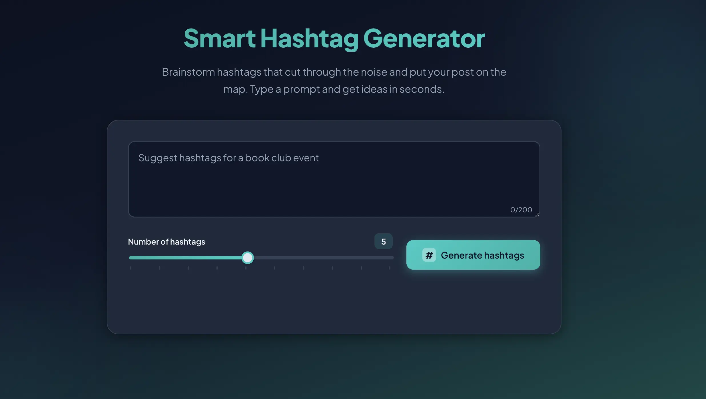
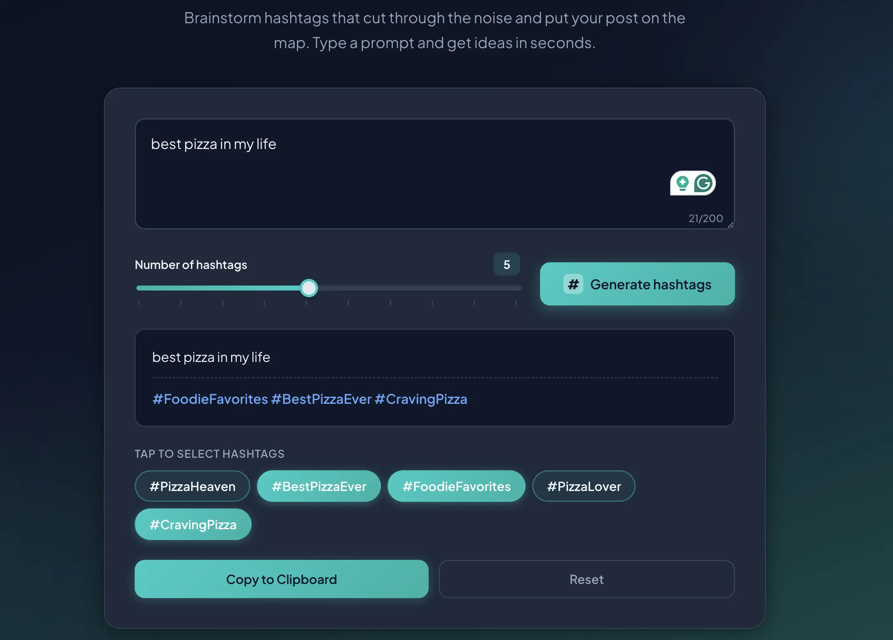

# Smart Hashtag Generator


**Smart Hashtag Generator** is a web application for quickly generating relevant hashtags for social media posts. Paste or type your post, select the number of hashtags, and click **Generate Hashtags**. The AI will generate relevant hashtags, which you can add to your original post by clicking on them. Once you've selected the desired hashtags, the final post can be copied to your clipboard and shared on your social media.

---

## Screenshots / Demo

**Main Page**  


**Hashtag Generation**  


---

## Features

- **AI-powered hashtag generation** — describe your post and get relevant hashtag ideas in seconds
- **Modern responsive UI** — mobile-first layout that works on phones, tablets, and desktops
- **Dark & light themes** — toggle between themes; your preference is saved and restored on reload
- **Interactive hashtag selection** — tap hashtags to select/deselect; selected tags appear in a preview panel
- **Copy to clipboard** — copy your post with selected hashtags in one click
- **Animated placeholders** — rotating example prompts in the input field
- **Character counter** — live 200-character limit on the prompt input

---

## UI / UX Updates

Recent improvements to the interface:

- **Card-based layout** with gradient background, soft accent orbs, and Plus Jakarta Sans typography
- **Fully responsive design** using fluid spacing, flexible controls, and stacked layouts on small screens
- **Dark theme** powered by CSS variables, with system preference detection on first visit
- **Theme toggle** — fixed in the top-right corner on desktop; placed above the title on mobile to avoid overlap
- **Refined components** — pill-style hashtag chips, gradient buttons, improved slider, inline loader, and fade-in results
- **Accessibility** — screen-reader labels, `aria-pressed` on hashtag chips, and keyboard focus states

---

## Technologies

- React 19
- Sass (CSS Modules)
- OpenAI API
- Notiflix (notifications)

---

## Installation and Running the Project

Clone the repository:

```bash
git clone https://github.com/pylypchukroman/smart_hashtag_generator.git
cd smart_hashtag_generator
npm install
```

Create a `.env` file in the project root:

```env
REACT_APP_OPENAI_API_KEY=your_api_key_here
```

Start the development server:

```bash
npm start
```

The app will be available at [http://localhost:3000](http://localhost:3000).

Build for production:

```bash
npm run build
```

---

## Usage

1. Enter or paste your social media post into the text field (minimum 6 characters).
2. Adjust the slider to choose how many hashtags to generate (1–10).
3. Click **Generate hashtags**.
4. Tap hashtags to select the ones you want to include.
5. Click **Copy to Clipboard** to copy your post with the selected hashtags.
6. Use the sun/moon toggle in the top-right (desktop) or above the title (mobile) to switch between light and dark themes.

---

## Project Structure

```
src/
├── api/                  # OpenAI integration
├── components/
│   ├── Hero/             # Page title and description
│   ├── Input/            # Prompt textarea with animated placeholders
│   ├── MainInput/        # Form with slider and submit button
│   ├── Output/           # Generated hashtags and action buttons
│   ├── Hashtag/          # Individual hashtag chip
│   ├── Loader/           # Loading indicator
│   └── ThemeToggle/      # Light/dark mode switcher
├── context/              # React context (input, hashtags, theme)
└── styles/               # Shared SCSS variables and mixins
```

---

## TODO / Future Plans

- Add the ability to save post templates
- Add multilingual AI generation
- Update screenshots to reflect the new UI
